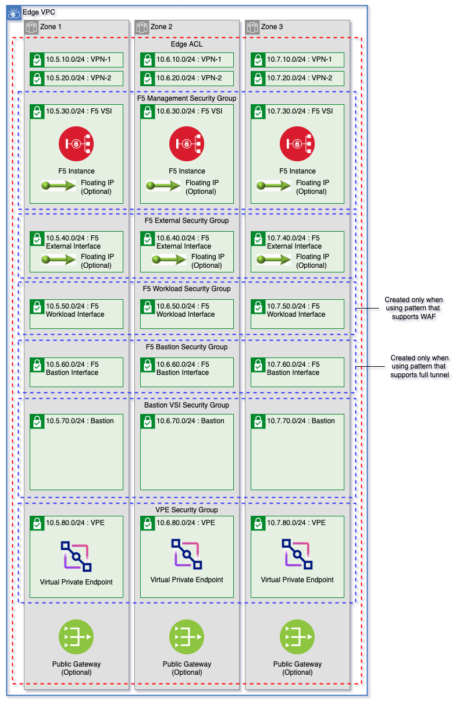

# ICSE F5 Edge Deployment Module

Manage edge VPC subnets, create network infrastucture for F5 BIG-IP provisioning, and install F5 onto virtual servers.

Using this module users, can optionally provision the F5 BIG-IP and setup the implemented solution of a client-to-site VPN and/or web application firewall (WAF). Thid module is designed to be used with the [ICSE Flexible Landing Zone Template](https://github.com/Cloud-Schematics/icse-flexible-vpc-cluster-template).



---

## Table of Contents

1. [Prerequisites](#prerequisites)
    - [Network Subnet CIDRs](#network-subnet-cidrs)
    - [Reserved Subnet Address Prefixes](#reserved-subnet-address-prefixes)
2. [Edge VPC](#edge-vpc)
    - [Edge VPC Variables](#edge-vpc-variables)
3. [Virtual Private Endpoints](#virtual-private-endpoints)
4. [Virtual Servers](#virtual-servers)
5. [Security Groups](#security-groups)
    - [F5 Bastion Interface Security Group](#f5-bastion-interface-security-group)
    - [F5 External Security Group](#f5-external-security-group)
    - [F5 Management Security Group](#f5-management-security-group)
    - [F5 Workload Security Group](#f5-workload-security-group)


---

## Prerequisites

1. F5 BIG-IP Virtual Edition license.
2. Additional IAM VPC Infrastructure Service service access of `IP Spoofing operator`
3. [Contact support](https://cloud.ibm.com/unifiedsupport/cases/form) to increase the quota for subnets per VPC. The below chart shows the number of subnets needed dependent on the F5 BIG-IP deployment but it is best to ask for 30 subnets per VPC if using 3 zones. The chart below notes the CIDR blocks and the zones that each type is deployed. The `vpn-1`, `vpn-2`, `bastion`, and `vpe` subnet tiers can be disabled.

### Network Subnet CIDRs

Name          | Zone 1 CIDR Block | Zone 2 CIDR Block | Zone 3 CIDR Block | WAF   | Full Tunnel   | VPN and WAF   | Variable
--------------| ------------------|-------------------|-------------------|:-----:|:-------------:|:-------------:| ---------
vpn-1         | 10.5.10.0/24      | 10.6.10.0/24      | 10.7.10.0/24      | ✅    | ✅             | ✅            | `create_vpn_1_subnet_tier`
vpn-2         | 10.5.20.0/24      | 10.6.20.0/24      | 10.7.20.0/24      | ✅    | ✅             | ✅            | `create_vpn_2_subnet_tier`
f5-management | 10.5.30.0/24      | 10.6.30.0/24      | 10.7.30.0/24      | ✅    | ✅             | ✅            | n/a
f5-external   | 10.5.40.0/24      | 10.6.40.0/24      | 10.7.40.0/24      | ✅    | ✅             | ✅            | n/a
f5-workload   | 10.5.50.0/24      | 10.6.50.0/24      | 10.7.50.0/24      | ✅    | ❌             | ✅            | n/a
f5-bastion    | 10.5.60.0/24      | 10.6.60.0/24      | 10.7.60.0/24      | ❌    | ✅             | ✅            | n/a
bastion       | 10.5.70.0/24      | 10.6.70.0/24      | 10.7.70.0/24      | ✅    | ✅             | ✅            | `bastion_subnet_zones`
vpe           | 10.5.80.0/24      | 10.6.80.0/24      | 10.7.80.0/24      | ✅    | ✅             | ✅            | `create_vpe_subnet_tier`

### Reserved Subnet Address Prefixes

To ensure proper provisioning on an existing VPC or are planning to connect your edge VPC to an existing transit gateway instance, ensure that the following subnet CIDR blocks are not currently in use by the network.

Zone | Prefix
-----|--------
1    | 10.5.0.0/16
2    | 10.6.0.0/16
3    | 10.7.0.0/16

---

## Edge VPC

The Edge VPC networking components (VPC, Subnets, Network ACLs, Public Gateways) are managed using the [ICSE Edge VPC Network module](https://github.com/Cloud-Schematics/icse-edge-vpc-network). For a complete 

Users can choose to optionally create a new edge VPC, or create edge VPC subnets on an existing VPC by passing the existing VPC ID using the `vpc_id` variable. If `vpc_id` is `null`, a new edge VPC will be created.

For a full detailed explanation of the networking components created, ready the edge vpc network documentation [here](./.docs/edge-vpc.md).

---

### Edge VPC Variables

Name                       | Type                                                                                                                                                                                 | Description                                                                                                                                                                                                                                                               | Sensitive | Default
-------------------------- | ------------------------------------------------------------------------------------------------------------------------------------------------------------------------------------ | ------------------------------------------------------------------------------------------------------------------------------------------------------------------------------------------------------------------------------------------------------------------------- | --------- | ----------------------------------------------------------------------------------------------------------------------------------------------
vpc_id                     | string                                                                                                                                                                               | ID of the VPC where VSI will be provisioned. If VPC ID is `null`, a VPC will be created automatically.                                                                                                                                                                    |           | null
existing_public_gateways   | object({ zone-1 = string zone-2 = string zone-3 = string })                                                                                                                          | Use existing public gateways for VPC id if not creating. If creating a new VPC this value will be ignored.                                                                                                                                                                |           | {<br>zone-1 = null<br>zone-2 = null<br>zone-3 = null<br>}
create_public_gateways     | bool                                                                                                                                                                                 | Create public gateways on the VPC. Public gateways will be created in each zone where an existing public gateway id has not been passed in using the `existing_public_gateways` variable. Public gateways will not be created in zones greater than the `zones` variable. |           | true
create_vpc_options         | object({ classic_access = optional(bool) default_network_acl_name = optional(string) default_security_group_name = optional(string) default_routing_table_name = optional(string) }) | Options to use when using this module to create a VPC.                                                                                                                                                                                                                    |           | {<br>classic_access = false<br>default_network_acl_name = null<br>default_security_group_name = null<br>default_routing_table_name = null<br>}
zones                      | number                                                                                                                                                                               | Number of zones for edge VPC creation                                                                                                                                                                                                                                     |           | 3
add_cluster_rules          | bool                                                                                                                                                                                 | Automatically add needed ACL rules to allow each network to create and manage Openshift and IKS clusters.                                                                                                                                                                 |           | false
global_inbound_allow_list  | list(string)                                                                                                                                                                         | List of CIDR blocks where inbound traffic will be allowed. These allow rules will be added to each network acl.                                                                                                                                                           |           | [<br>"10.0.0.0/8",<br>"161.26.0.0/16"<br>]
global_outbound_allow_list | list(string)                                                                                                                                                                         | List of CIDR blocks where outbound traffic will be allowed. These allow rules will be added to each network acl.                                                                                                                                                          |           | [<br>"0.0.0.0/0"<br>]
global_inbound_deny_list   | list(string)                                                                                                                                                                         | List of CIDR blocks where inbound traffic will be denied. These deny rules will be added to each network acl. Deny rules will be added after all allow rules.                                                                                                             |           | [<br>"0.0.0.0/0"<br>]
global_outbound_deny_list  | list(string)                                                                                                                                                                         | List of CIDR blocks where outbound traffic will be denied. These deny rules will be added to each network acl. Deny rules will be added after all allow rules.                                                                                                            |           | []
create_vpn_1_subnet_tier   | bool                                                                                                                                                                                 | Create VPN-1 subnet tier.                                                                                                                                                                                                                                                 |           | true
create_vpn_2_subnet_tier   | bool                                                                                                                                                                                 | Create VPN-1 subnet tier.                                                                                                                                                                                                                                                 |           | true
bastion_subnet_zones       | number                                                                                                                                                                               | Create Bastion subnet tier for each zone in this list. Bastion subnets created cannot exceed number of zones in `var.zones`. These subnets are reserved for future bastion VSI deployment.                                                                                |           | 1

---

## Virtual Private Endpoints

By setting the [create_vpe_subnet_tier variable](./variables.tf#L192) to `true`, a virtual private endpoint gateway will be provisioned for each service listed in the [vpe-services variable](./variables.tf#L198). Usually, this is only needed if a new Edge VPC will be created for your deployment.

Virtual private endpoint, gateways, and reserved IPs are created using the [ICSE Virtual Private Endpoints Module](https://github.com/Cloud-Schematics/vpe-module).

---

## Virutal Servers

F5 BIG-IP virtual servers are created dynamically based on the number of zones, template configuration, and desired pattern. The supported patterns are `full-tunnel`, `vpn`, and `waf`. A pattern must be selected using the [vpn_firewall_type variable](./variables.tf#L210). Configuration for the virtual servers can be found in [f5_config_template.tf](./f5_config_template.tf).

---

### F5 Virtual Server Variables

Name                         | Type         | Description                                                                                                                                                                                                                                                                                                        | Sensitive | Default
---------------------------- | ------------ | ------------------------------------------------------------------------------------------------------------------------------------------------------------------------------------------------------------------------------------------------------------------------------------------------------------------ | --------- | ----------------------------------
vpn_firewall_type            | string       | F5 type. Can be `full-tunnel`, `waf`, or `vpn-and-waf`.                                                                                                                                                                                                                                                            |           | 
workload_cidr_blocks         | list(string) | List of workload CIDR blocks. This is used to create security group rules for the F5 management interface.                                                                                                                                                                                                         |           | []
bastion_cidr_blocks          | list(string) | List of bastion VSI CIDR blocks. These CIDR blocks are used to allow connections from the bastion CIDR to the F5 management interface. CIDR blocks from dynamically generated `bastion` tier are added automatically.                                                                                              |           | []
create_encryption_key        | bool         | Create encryption key for module.                                                                                                                                                                                                                                                                                  |           | true
kms_guid                     | string       | GUID of the key management service where an encryption key for virtual servers will be stored.                                                                                                                                                                                                                     |           | null
key_management_endpoint_type | string       | Endpoint type for encryption key provision. Can be `public` or `private`. Use `public` for provision via local machine.                                                                                                                                                                                            |           | public
deployment_name              | string       | Name of the virtual server deployment. The prefix will be prepended to this name and the zone added to the end. ex. `<your prefix>-<deployment name>-<zone>`.                                                                                                                                                      |           | f5
f5_image_name                | string       | Name of the F5 Big IP image to use for module. Image ID will be dynamically looked up using the map in `f5_config_image.tf` based on region. Must be one of `f5-bigip-15-1-5-1-0-0-14-all-1slot`,`f5-bigip-15-1-5-1-0-0-14-ltm-1slot`, `f5-bigip-16-1-2-2-0-0-28-ltm-1slot`,`f5-bigip-16-1-2-2-0-0-28-all-1slot`]. |           | f5-bigip-16-1-2-2-0-0-28-all-1slot
profile                      | string       | Type of machine profile for VSI. Use the command `ibmcloud is instance-profiles` to find available profiles in your region                                                                                                                                                                                         |           | cx2-4x8
ssh_key_ids                  | list(string) | List of SSH Key IDs to use when provisioning virtual server instances.                                                                                                                                                                                                                                             |           | 
enable_f5_management_fip     | bool         | Enable F5 management interface floating IP. Conflicts with `enable_f5_external_fip`, VSI can only have one floating IP per instance.                                                                                                                                                                               |           | false
enable_f5_external_fip       | bool         | Enable F5 external interface floating IP. Conflicts with `enable_f5_management_fip`, VSI can only have one floating IP per instance.                                                                                                                                                                               |           | true

---

### F5 Template Data Variable

F5 template data is rendered using the [f5_template_data variable](./variables.tf#L238). Fields marked as `optional` are not required.

- The `tmos_admin_password` field must be at least 15 characters, contain one numberic, one uppercase, and one lowercase character.
- `license_type` must be `none`, `byol`, `regkeypool`, or `utilitypool`.

```terraform
variable "f5_template_data" {
  description = "Data for all f5 templates"
  sensitive   = true
  type = object({
    domain                  = string
    hostname                = string
    license_type            = string
    tmos_admin_password     = string
    byol_license_basekey    = optional(string)
    default_route_interface = optional(string)
    license_host            = optional(string)
    license_username        = optional(string)
    license_password        = optional(string)
    license_pool            = optional(string)
    license_sku_keyword_1   = optional(string)
    license_sku_keyword_2   = optional(string)
    license_unit_of_measure = optional(string)
    do_declaration_url      = optional(string)
    as3_declaration_url     = optional(string)
    ts_declaration_url      = optional(string)
    phone_home_url          = optional(string)
    template_source         = optional(string)
    template_version        = optional(string)
    app_id                  = optional(string)
    tgactive_url            = optional(string)
    tgstandby_url           = optional(string)
    tgrefresh_url           = optional(string)
  })

  default = {
    domain              = "test.com"
    hostname            = "example"
    tmos_admin_password = "Iamapassword2ru"
    license_type        = "none"
  }
}
```

---

## Security Groups

Security groups are dynamically created for F5 VSI interfaces. Configuration for these security groups can be found in [f5_security_group_config.tf](./f5_security_group_config.tf). Security groups are created in [main.tf](./main.tf#L50). Security groups are created **before** provisioning of virtual server instances.

---

### F5 Bastion Interface Security Group

This security group is created when using an F5 pattern that supports VPN. The following security group rules are added to each `f5-bastion` interface for each `bastion` subnet tier provisioned.

Protocol | Direction | Remote              | Source Port | Destination Port | Allow / Deny
---------|-----------|---------------------|-------------|------------------|---------------
TCP      | Inbound   | Bastion Subnet CIDR | 3023 - 3025 | Any              | Allow
TCP      | Inbound   | Bastion Subnet CIDR | 3080        | Any              | Allow
TCP      | Outbound  | Bastion Subnet CIDR | Any         | 3023 - 3025      | Allow
TCP      | Outbound  | Bastion Subnet CIDR | Any         | 3080             | Allow

---

### F5 External Security Group

This security group is created and attached to the `f5-external` VSI interface with the following rule:

Protocol | Direction | Remote              | Source Port | Destination Port | Allow / Deny
---------|-----------|---------------------|-------------|------------------|---------------
TCP      | Inbound   | 0.0.0.0/0           | Any         | 443              | Allow
TCP      | Outbound  | 0.0.0.0/0           | 443         | Any              | Allow

---

### F5 Management Security Group

This security group is created for and attached to the `f5-management` VSI interface. Rules marked with a `*` will have multiple rules created based on the number of bastion subnets created.

Protocol | Direction | Remote                                    | Source Port | Destination Port | Allow / Deny
---------|-----------|-------------------------------------------|-------------|------------------|---------------
TCP      | Outbound  | Each Bastion Subnet CIDR*                 | Any         | 443              | Allow
TCP      | Outbound  | Each Bastion Subnet CIDR*                 | Any         | 22               | Allow
Any      | Inbound   | IBM Internal Service CIDR (161.26.0.0/16) | Any         | Any              | Allow
TCP      | Outbound  | IBM Internal Service CIDR (161.26.0.0/16) | Any         | 443              | Allow
TCP      | Outbound  | IBM Internal Service CIDR (161.26.0.0/16) | Any         | 80               | Allow
TCP      | Outbound  | IBM Internal Service CIDR (161.26.0.0/16) | Any         | 53               | Allow
Any      | Inbound   | VPC Internal Traffic (10.0.0.0/8)         | Any         | Any              | Allow
Any      | Outbound  | VPC Internal Traffic (10.0.0.0/8)         | Any         | Any              | Allow

---

### F5 Workload Security Group

The `f5-workload` security group is created for patterns using `waf`. The following networking rules are created for the workload VSI interfaces. Rules marked with a `*` will have multiple rules created based on the [workload_cidr_blocks variable](./variables.tf#L220).

Protocol | Direction | Remote                                    | Source Port | Destination Port | Allow / Deny
---------|-----------|-------------------------------------------|-------------|------------------|---------------
TCP      | Outbound  | Each Workload Subnet CIDR*                | Any         | 443              | Allow
Any      | Inbound   | IBM Internal Service CIDR (161.26.0.0/16) | Any         | Any              | Allow
TCP      | Outbound  | IBM Internal Service CIDR (161.26.0.0/16) | Any         | 443              | Allow
TCP      | Outbound  | IBM Internal Service CIDR (161.26.0.0/16) | Any         | 80               | Allow
TCP      | Outbound  | IBM Internal Service CIDR (161.26.0.0/16) | Any         | 53               | Allow
Any      | Inbound   | VPC Internal Traffic (10.0.0.0/8)         | Any         | Any              | Allow
Any      | Outbound  | VPC Internal Traffic (10.0.0.0/8)         | Any         | Any              | Allow

---

## Module Variables

Name                         | Type                                                                                                                                                                                                                                                                                                                                                                                                                                                                                                                                                                                                                                                                                                                                                                                                             | Description                                                                                                                                                                                                                                                                                                        | Sensitive | Default
---------------------------- | ---------------------------------------------------------------------------------------------------------------------------------------------------------------------------------------------------------------------------------------------------------------------------------------------------------------------------------------------------------------------------------------------------------------------------------------------------------------------------------------------------------------------------------------------------------------------------------------------------------------------------------------------------------------------------------------------------------------------------------------------------------------------------------------------------------------- | ------------------------------------------------------------------------------------------------------------------------------------------------------------------------------------------------------------------------------------------------------------------------------------------------------------------ | --------- | -------------------------------------------------------------------------------------------------------------------------------
prefix                       | string                                                                                                                                                                                                                                                                                                                                                                                                                                                                                                                                                                                                                                                                                                                                                                                                           | The prefix that you would like to prepend to your resources                                                                                                                                                                                                                                                        |           | 
tags                         | list(string)                                                                                                                                                                                                                                                                                                                                                                                                                                                                                                                                                                                                                                                                                                                                                                                                     | List of Tags for the resource created                                                                                                                                                                                                                                                                              |           | null
resource_group_id            | string                                                                                                                                                                                                                                                                                                                                                                                                                                                                                                                                                                                                                                                                                                                                                                                                           | Resource group ID for the VSI                                                                                                                                                                                                                                                                                      |           | null
region                       | string                                                                                                                                                                                                                                                                                                                                                                                                                                                                                                                                                                                                                                                                                                                                                                                                           | The region where components will be created                                                                                                                                                                                                                                                                        |           | 
vpc_id                       | string                                                                                                                                                                                                                                                                                                                                                                                                                                                                                                                                                                                                                                                                                                                                                                                                           | ID of the VPC where VSI will be provisioned. If VPC ID is `null`, a VPC will be created automatically.                                                                                                                                                                                                             |           | null
existing_public_gateways     | object({ zone-1 = string zone-2 = string zone-3 = string })                                                                                                                                                                                                                                                                                                                                                                                                                                                                                                                                                                                                                                                                                                                                                      | Use existing public gateways for VPC id if not creating. If creating a new VPC this value will be ignored.                                                                                                                                                                                                         |           | { zone-1 = null zone-2 = null zone-3 = null }
create_public_gateways       | bool                                                                                                                                                                                                                                                                                                                                                                                                                                                                                                                                                                                                                                                                                                                                                                                                             | Create public gateways on the VPC. Public gateways will be created in each zone where an existing public gateway id has not been passed in using the `existing_public_gateways` variable. Public gateways will not be created in zones greater than the `zones` variable. Set to true when using WAF.              |           | true
create_vpc_options           | object({ classic_access = optional(bool) default_network_acl_name = optional(string) default_security_group_name = optional(string) default_routing_table_name = optional(string) })                                                                                                                                                                                                                                                                                                                                                                                                                                                                                                                                                                                                                             | Options to use when using this module to create a VPC.                                                                                                                                                                                                                                                             |           | { classic_access = false default_network_acl_name = null default_security_group_name = null default_routing_table_name = null }
zones                        | number                                                                                                                                                                                                                                                                                                                                                                                                                                                                                                                                                                                                                                                                                                                                                                                                           | Number of zones for edge VPC creation                                                                                                                                                                                                                                                                              |           | 3
add_cluster_rules            | bool                                                                                                                                                                                                                                                                                                                                                                                                                                                                                                                                                                                                                                                                                                                                                                                                             | Automatically add needed ACL rules to allow each network to create and manage Openshift and IKS clusters.                                                                                                                                                                                                          |           | false
global_inbound_allow_list    | list(string)                                                                                                                                                                                                                                                                                                                                                                                                                                                                                                                                                                                                                                                                                                                                                                                                     | List of CIDR blocks where inbound traffic will be allowed. These allow rules will be added to each network acl.                                                                                                                                                                                                    |           | [ "10.0.0.0/8", "161.26.0.0/16" ]
global_outbound_allow_list   | list(string)                                                                                                                                                                                                                                                                                                                                                                                                                                                                                                                                                                                                                                                                                                                                                                                                     | List of CIDR blocks where outbound traffic will be allowed. These allow rules will be added to each network acl.                                                                                                                                                                                                   |           | [ "0.0.0.0/0" ]
global_inbound_deny_list     | list(string)                                                                                                                                                                                                                                                                                                                                                                                                                                                                                                                                                                                                                                                                                                                                                                                                     | List of CIDR blocks where inbound traffic will be denied. These deny rules will be added to each network acl. Deny rules will be added after all allow rules.                                                                                                                                                      |           | [ "0.0.0.0/0" ]
global_outbound_deny_list    | list(string)                                                                                                                                                                                                                                                                                                                                                                                                                                                                                                                                                                                                                                                                                                                                                                                                     | List of CIDR blocks where outbound traffic will be denied. These deny rules will be added to each network acl. Deny rules will be added after all allow rules.                                                                                                                                                     |           | []
create_vpn_1_subnet_tier     | bool                                                                                                                                                                                                                                                                                                                                                                                                                                                                                                                                                                                                                                                                                                                                                                                                             | Create VPN-1 subnet tier.                                                                                                                                                                                                                                                                                          |           | true
create_vpn_2_subnet_tier     | bool                                                                                                                                                                                                                                                                                                                                                                                                                                                                                                                                                                                                                                                                                                                                                                                                             | Create VPN-1 subnet tier.                                                                                                                                                                                                                                                                                          |           | true
bastion_subnet_zones         | number                                                                                                                                                                                                                                                                                                                                                                                                                                                                                                                                                                                                                                                                                                                                                                                                           | Create Bastion subnet tier for each zone in this list. Bastion subnets created cannot exceed number of zones in `var.zones`. These subnets are reserved for future bastion VSI deployment.                                                                                                                         |           | 1
create_vpe_subnet_tier       | bool                                                                                                                                                                                                                                                                                                                                                                                                                                                                                                                                                                                                                                                                                                                                                                                                             | Create VPE subnet tier on edge VPC. Leave as false if provisioning network that already contains VPEs.                                                                                                                                                                                                             |           | false
vpe_services                 | list(string)                                                                                                                                                                                                                                                                                                                                                                                                                                                                                                                                                                                                                                                                                                                                                                                                     | List of VPE Services to use to create endpoint gateways.                                                                                                                                                                                                                                                           |           | ["cloud-object-storage", "kms"]
vpn_firewall_type            | string                                                                                                                                                                                                                                                                                                                                                                                                                                                                                                                                                                                                                                                                                                                                                                                                           | F5 type. Can be `full-tunnel`, `waf`, or `vpn-and-waf`.                                                                                                                                                                                                                                                            |           | 
workload_cidr_blocks         | list(string)                                                                                                                                                                                                                                                                                                                                                                                                                                                                                                                                                                                                                                                                                                                                                                                                     | List of workload CIDR blocks. This is used to create security group rules for the F5 management interface.                                                                                                                                                                                                         |           | []
bastion_cidr_blocks          | list(string)                                                                                                                                                                                                                                                                                                                                                                                                                                                                                                                                                                                                                                                                                                                                                                                                     | List of bastion VSI CIDR blocks. These CIDR blocks are used to allow connections from the bastion CIDR to the F5 management interface. CIDR blocks from dynamically generated `bastion` tier are added automatically.                                                                                              |           | []
f5_template_data             | object({ domain = string hostname = string license_type = string tmos_admin_password = string byol_license_basekey = optional(string) default_route_interface = optional(string) license_host = optional(string) license_username = optional(string) license_password = optional(string) license_pool = optional(string) license_sku_keyword_1 = optional(string) license_sku_keyword_2 = optional(string) license_unit_of_measure = optional(string) do_declaration_url = optional(string) as3_declaration_url = optional(string) ts_declaration_url = optional(string) phone_home_url = optional(string) template_source = optional(string) template_version = optional(string) app_id = optional(string) tgactive_url = optional(string) tgstandby_url = optional(string) tgrefresh_url = optional(string) }) | Data for all f5 templates                                                                                                                                                                                                                                                                                          | true      | { domain = "test.com" hostname = "example" tmos_admin_password = "Iamapassword2ru" license_type = "none" }
create_encryption_key        | bool                                                                                                                                                                                                                                                                                                                                                                                                                                                                                                                                                                                                                                                                                                                                                                                                             | Create encryption key for module.                                                                                                                                                                                                                                                                                  |           | true
kms_guid                     | string                                                                                                                                                                                                                                                                                                                                                                                                                                                                                                                                                                                                                                                                                                                                                                                                           | GUID of the key management service where an encryption key for virtual servers will be stored.                                                                                                                                                                                                                     |           | null
key_management_endpoint_type | string                                                                                                                                                                                                                                                                                                                                                                                                                                                                                                                                                                                                                                                                                                                                                                                                           | Endpoint type for encryption key provision. Can be `public` or `private`. Use `public` for provision via local machine.                                                                                                                                                                                            |           | public
deployment_name              | string                                                                                                                                                                                                                                                                                                                                                                                                                                                                                                                                                                                                                                                                                                                                                                                                           | Name of the virtual server deployment. The prefix will be prepended to this name and the zone added to the end. ex. `<your prefix>-<deployment name>-<zone>.                                                                                                                                                       |           | f5
f5_image_name                | string                                                                                                                                                                                                                                                                                                                                                                                                                                                                                                                                                                                                                                                                                                                                                                                                           | Name of the F5 Big IP image to use for module. Image ID will be dynamically looked up using the map in `f5_config_image.tf` based on region. Must be one of `f5-bigip-15-1-5-1-0-0-14-all-1slot`,`f5-bigip-15-1-5-1-0-0-14-ltm-1slot`, `f5-bigip-16-1-2-2-0-0-28-ltm-1slot`,`f5-bigip-16-1-2-2-0-0-28-all-1slot`]. |           | f5-bigip-16-1-2-2-0-0-28-all-1slot
profile                      | string                                                                                                                                                                                                                                                                                                                                                                                                                                                                                                                                                                                                                                                                                                                                                                                                           | Type of machine profile for VSI. Use the command `ibmcloud is instance-profiles` to find available profiles in your region                                                                                                                                                                                         |           | cx2-4x8
ssh_key_ids                  | list(string)                                                                                                                                                                                                                                                                                                                                                                                                                                                                                                                                                                                                                                                                                                                                                                                                     | List of SSH Key IDs to use when provisioning virtual server instances.                                                                                                                                                                                                                                             |           | 
enable_f5_management_fip     | bool                                                                                                                                                                                                                                                                                                                                                                                                                                                                                                                                                                                                                                                                                                                                                                                                             | Enable F5 management interface floating IP. Conflicts with `enable_f5_external_fip`, VSI can only have one floating IP per instance.                                                                                                                                                                               |           | false
enable_f5_external_fip       | bool                                                                                                                                                                                                                                                                                                                                                                                                                                                                                                                                                                                                                                                                                                                                                                                                             | Enable F5 external interface floating IP. Conflicts with `enable_f5_management_fip`, VSI can only have one floating IP per instance.                                                                                                                                                                               |           | true

---

## Module Outputs

Name             | Description
---------------- | -------------------------------------------------------------------------------
vpc_id           | ID of edge VPC
network_acl      | Network ACL name and ID
public_gateways  | Edge VPC public gateways
subnet_zone_list | List of subnet ids, cidrs, names, and zones.
subnet_tiers     | Map of subnet tiers where each key contains the subnet zone list for that tier.
security_groups  | List of security groups created.
virtual_servers  | List of virtual servers created by this module.